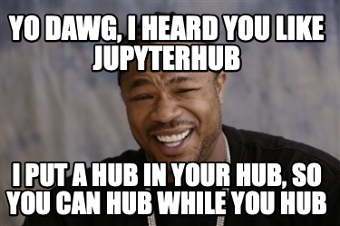

# jupyterhub-yo-dawg

Demonstrating JupyterHub with JupyterHub as an OAuth provider.



This is currently two configuration files:

`hubhub/jupyterhub_config.py`: Configuration for the 'canonical' Hub.
This contains the service definition,
registering the 'sub hub' as an oauth client.

`subhub/jupyterhub_config.py`: Configuration for JuptyerHub
to use the 'hub hub' as an OAuth provider,
using Generic OAuthenticator.

The main configuration needed:

- client id
- client secret
- authorize url (`/hub/api/oauth2/authorize`)
- token url (`/hub/api/oauth2/token`)
- userdata url (`/hub/api/user`)
- client_id, client_secret in POST params for token url

## Run it

In one terminal:

```bash
cd hubhub
jupyterhub
```

and in another:

```bash
cd subhub
jupyterhub
```

Then visit `http://subhub.local.minrk.net`

### Notes

- Since both Hubs are on the same host (localhost),
  to avoid cookie collision issues,
  I use different hosts.
  I have `*.local.minrk.net` wildcard DNS mapping to localhost,
  so I use `subhub` and `hubhub` respectively.
  Feel free to use these,
  or if you don't want to trust my DNS,
  you can use your own or pick two ips or hostnames for your machine.
